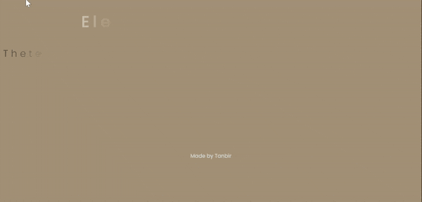

# Text Reveal Animation



This repository contains code for implementing a text reveal animation using React and Framer Motion library. The animation gradually reveals each character of the text, creating an elegant effect that enhances the visual appeal of textual content.

## Installation

To use this animation in your project, follow these steps:

1. Clone the repository or copy the necessary files into your project directory.
2. Make sure you have React and Framer Motion library installed in your project. If not, you can install them using npm or yarn:

```bash
npm install react framer-motion
```

or

```
yarn add react framer-motion

```

## Start The Dev Server


```
npm run dev

```
```
yarn dev

```

## Usage

To implement the text reveal animation in your React project:

1. Import the motion component from Framer Motion library.
2. Define your text content (heading, paragraph, etc.).
3. Split the text into individual characters using the provided splitTextUsingRegex utility function.
4. Define animation variants for revealing the text characters.
5. Use the motion component to animate each character individually.
6. Adjust animation properties such as duration, stagger, etc., according to your preference.
7. Customize the styles as needed.


